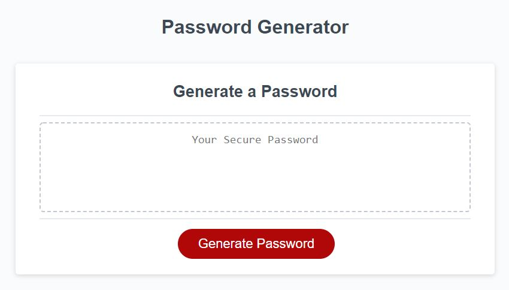

# Random Password Generator

## Description
This random password generator allows the user to create a unique password. It takes in several inputs from the user including length and 4 different options for character types to include. It then generates and displays a strong randomized password based on that criteria. It also includes input validation to make sure the user enters valid data.

This project was a great oppurtunity to learn the difference between alerts, prompts and confirm methods for user interaction. It also tested my skills in loops, string manipulation, and the use of random number/character generation.

## Usage
Visit the live site at the following URL: 
<a href="https://jonmooney.github.io/friendly-parakeet" title="CTRL+Click to open in a new window">https://jonmooney.github.io/friendly-parakeet/</a> 

Use the 'Generate Password' button to try making different passwords of varying lengths and character types.

### Screenshot: Overall look

## Features
- HTML 
- CSS 
- JavaScript - loops, functions, event listener, minor DOM manipulation 
- Git/GitHub

## Credits
Basic HTML provided by UC Davis Coding Bootcamp, JavaScript by Jon Mooney
